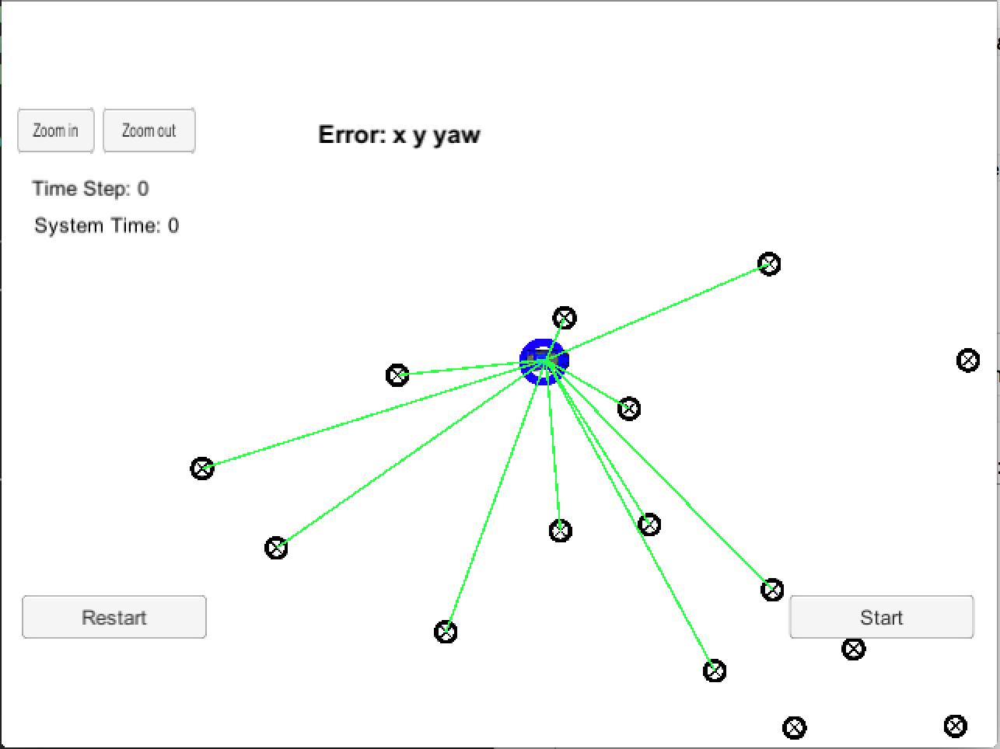

# Localization with Particle Filters - Finding a Kidnapped Vehicle

## Project Introduction
Your robot has been kidnapped and transported to a new location! Luckily it has a map of this location, a (noisy) GPS estimate of its initial location, and lots of (noisy) sensor and control data.

In this project you will implement a 2 dimensional particle filter in C++. Your particle filter will be given a map and some initial localization information (analogous to what a GPS would provide). At each time step your filter will also get observation and control data. 

## Running the Code
Once you have this repository on your machine, cd into the repository's root directory and run the following commands from the command line:

```
$ ./clean.sh
$ ./build.sh
$ ./run.sh
```
While the simuation is running, the output should be:

```
Listening to port 4567
Connected!!!
```
## Running the Filter

After running the simulation and car has been localized correctly, you should see the following output:

```
Success! Your particle filter passed!
```

The following is the image from the simulation:


Here is video of successful run:
